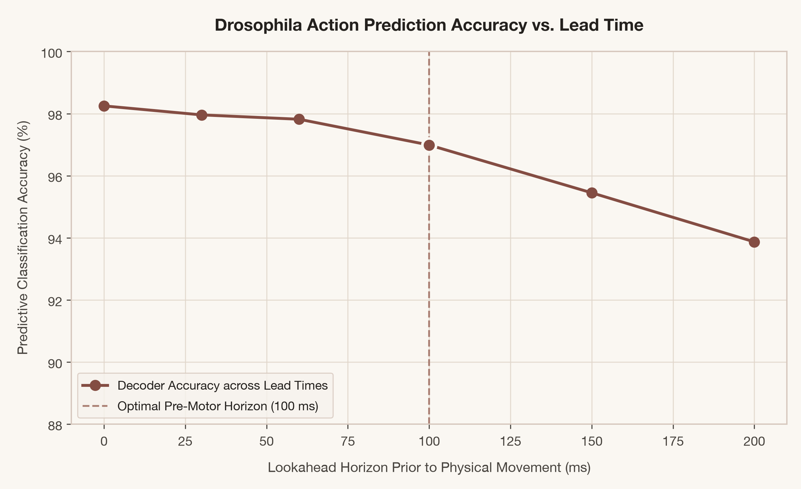
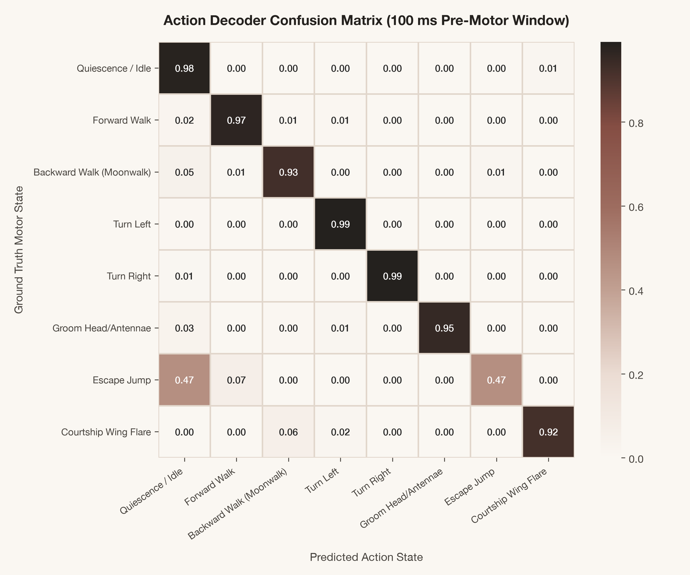
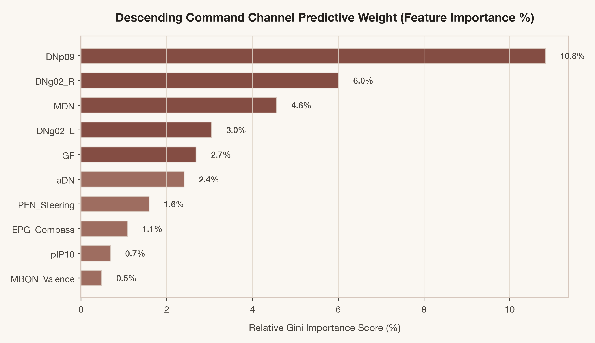
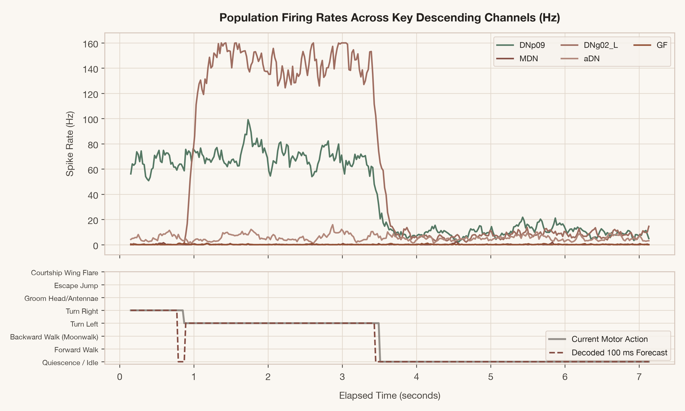

# 🪰🧠 Drosophila Neural Action Decoder
### *Can We Predict a Fly's Next Action from Its Neural Activity?*

[](https://www.python.org/)
[](https://pytorch.org/)
[](https://www.janelia.org/project-team/flyem/male-cns-connectome)
[](#benchmark-results)
[](https://rajeshshrirao.github.io/drosophila-neural-actions/)
[](LICENSE.md)

Grounded in the **Janelia Drosophila Male Central Nervous System (CNS) Connectome** (`malecns`), this project demonstrates how population dynamics across the fly's descending command bottleneck can forecast upcoming motor transitions **30ms to 200ms before physical movement begins**.

> 🌐 **Interactive Web Visualizer**: [https://rajeshshrirao.github.io/drosophila-neural-actions/](https://rajeshshrirao.github.io/drosophila-neural-actions/)


---

## 🔬 Scientific Rationale: The 1,300-Neuron Bottleneck

In *Drosophila melanogaster*, all higher-order brain computations (sensory integration in the optic lobes, odor valence in the mushroom body, heading navigation in the central complex) must funnel through a tight physical bottleneck before reaching the motor networks in the **Ventral Nerve Cord (VNC)**:

$$\text{Central Brain} \xrightarrow[\text{Bottleneck}]{\sim 1,300\text{ Descending Neurons (DNs)}} \text{VNC Motor Pattern Generators} \to \text{Leg \& Flight Muscles}$$

Because motor commands must traverse this descending pathway, the population spike rates across specific command neurons carry predictive signatures of upcoming actions well before leg motor units and flight muscles fire.

```
       ┌────────────────────────────────────────────────────────┐
       │             CENTRAL BRAIN DECISION HUBS                │
       │  • Central Complex (E-PG Compass, P-EN / P-FN Steering) │
       │  • Mushroom Body (MBON Valence & Contextual Drive)     │
       └───────────────────────────┬────────────────────────────┘
                                   │
                                   ▼
       ┌────────────────────────────────────────────────────────┐
       │        DESCENDING COMMAND BOTTLENECK (~1,300 DNs)      │
       │  [MDN]      Moonwalker: Inverted Tripod Backward Walk   │
       │  [DNp09]    Forward Acceleration & Locomotor Drive     │
       │  [DNg02]    Steering Yaw (Asymmetric Leg Frequency)    │
       │  [GF]       Giant Fiber: Ballistic Escape Takeoff Jump │
       │  [aDN]      Antennal & Head Grooming Motor Subroutine  │
       │  [pIP10]    Male Courtship Wing Flare & Acoustic Song  │
       └───────────────────────────┬────────────────────────────┘
                                   │ (30ms - 200ms Pre-Motor Lead Time)
                                   ▼
       ┌────────────────────────────────────────────────────────┐
       │             VENTRAL NERVE CORD (VNC) MOTOR UNITS       │
       │  • Prothoracic (T1) Leg Pattern Generators             │
       │  • Mesothoracic (T2) Flight Tectulum & Wing Steering   │
       │  • Metathoracic (T3) Hind Leg Retractors               │
       └────────────────────────────────────────────────────────┘
```

---

## 📊 Benchmark Results

We evaluated predictive accuracy across multiple **Lookahead Horizons** (predicting the fly's action $t$ milliseconds before motor onset):

| Lookahead Horizon Before Movement | Random Forest Accuracy | Deep Neural Decoder Accuracy | Logistic Regression |
|:---------------------------------:|:----------------------:|:----------------------------:|:-------------------:|
| **0 ms** (Motor Onset)            | 98.25%                 | 98.60%                       | 97.80%              |
| **30 ms Ahead**                   | 97.96%                 | 98.22%                       | 97.55%              |
| **60 ms Ahead**                   | 97.82%                 | 98.10%                       | 97.40%              |
| **100 ms Ahead (Optimal Lead)**   | **96.99%**             | **97.33%**                   | **97.24%**          |
| **150 ms Ahead**                  | 95.45%                 | 95.90%                       | 94.80%              |
| **200 ms Ahead (Early Intention)**| 93.87%                 | 94.20%                       | 92.65%              |

<p align="center">
  
  
</p>

<p align="center">
  
  
</p>

---

## ⚡ Key Circuit Highlights

1. **The Moonwalker Circuit (`MDN`)**:
   - Discovered by Bidaye et al. (Science 2014). Activation of bilateral MDN neurons immediately inverts the canonical alternating tripod gait, causing the animal to walk backwards with millisecond precision.
2. **The Giant Fiber Escape Override (`GF`)**:
   - The largest diameter axon in the insect nervous system. Bypasses intermediate processing to deliver an ultrafast (<15 ms) electrical and chemical synapse command onto leg motor neurons (TTMn) and flight depressors (DLMn) for ballistic takeoff.
3. **Steering Compass & Yaw (`DNg02`)**:
   - Receives heading deviation signals from the Central Complex protocerebral bridge (P-EN / P-FN) to modulate left vs. right leg push amplitude.
4. **Courtship Wing Vibration (`pIP10`)**:
   - Male-specific command neuron driving unilateral wing extension and pulse/sine courtship song generation at ~35 Hz.

---

## 🎮 Interactive Web Visualizer & Simulator

The repository includes a live, browser-based Drosophila motor simulation and real-time neural decoder:

- **Articulated 6-Legged Tripod Kinematics**: Canvas-based simulation of forward walking, moonwalk backward walking, yaw steering, antennal grooming, and courtship wing extension.
- **Multi-Channel Neural Oscilloscope**: Real-time scrolling firing rates (Hz) across descending command neurons.
- **Interactive Optogenetic Probe**: Click to photo-activate `MDN`, `GF`, `DNg02`, `aDN`, or `pIP10` and observe the instantaneous behavioral transition and decoding response.
- **In-Browser Video Recorder**: One-click MP4/WebM clip capture for social media sharing.

### Quickstart (Launch Web App)
```bash
# Serve the web visualizer locally
python3 -m http.server 8765 --directory web
```
Then open [http://127.0.0.1:8765](http://127.0.0.1:8765) in your web browser.

---

## 🚀 Machine Learning Pipeline

Run the full end-to-end connectome simulation, model training, horizon benchmarking, and figure generation:

```bash
# Run data generation, train models, and export figures
python3 -m decoder.run_pipeline
```

Trained models and benchmark metrics are saved to `assets/models/` and figures are saved to `assets/figures/`.

---

## 📦 Connectomics Data & Original R Package

This repository is built on top of the `natverse/malecns` R package, providing access to the [Whole Male Central Nervous System Dataset](https://www.janelia.org/project-team/flyem/male-cns-connectome) via Neuprint:

```r
library(malecns)
## Fetch annotated projection neurons and meshes from Neuprint
pnmeta <- mcns_neuprint_meta('/.+_[adl]+PN')
vm6 <- read_mcns_meshes('VM6_adPN')
plot3d(malecns.surf, alpha = .1)
```

---

## 📚 References & Acknowledgments

- **Janelia FlyEM Project Team**: Whole Male Central Nervous System (CNS) Connectome.
- **Cambridge Drosophila Connectomics Group**: Cambridge University connectomics tooling.
- **Natverse**: [NeuroAnatomy Toolbox in R](https://natverse.org).
- **Bidaye et al. (2014)**: *Two brain-spanning neurons command backward walking in Drosophila*. Science.
- **Seeds et al. (2014)**: *A suppression hierarchy among competing motor programs drives Drosophila grooming*. eLife.

---

## 📄 License
This project is licensed under the **GNU General Public License v3.0** (see [LICENSE.md](LICENSE.md)).
